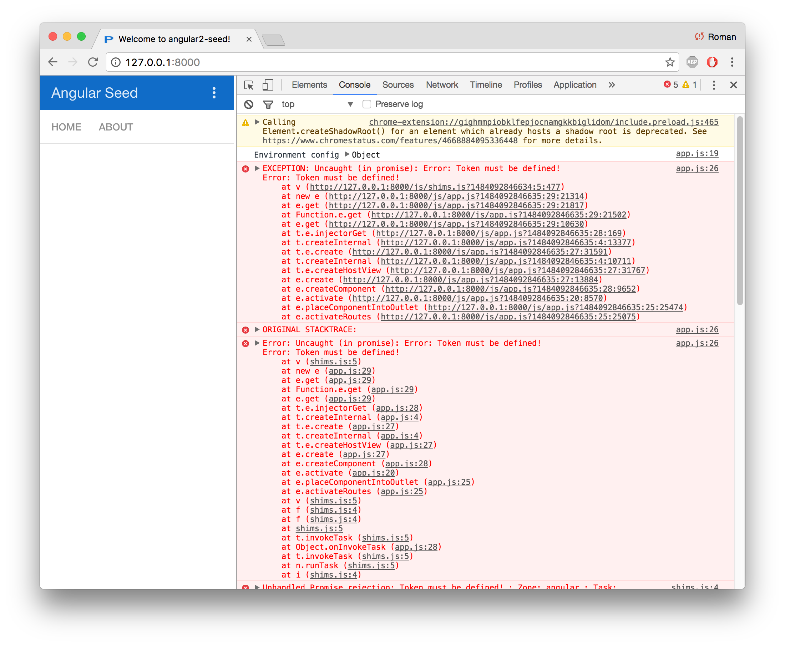

# Introduction

This is a sample repo to reproduce bsModal 'Token must be defined' for [ng2-bootstrap](https://github.com/valor-software/ng2-bootstrap) 1.1.16-11 and Angular 2.4.1

This build routine is based on [angular-seed](https://github.com/mgechev/angular-seed)

ng2-bootstrap Systemjs config: **tools/config/project.config.ts**
ng2-bootstrap in ngModule: **src/client/app/shared/shared.module.ts**
ng2-bootstrap Modals use: **src/client/app/home/home.component.html**

# Steps to reproduce the issue

```bash
# install node modules and runs seed preinstall routine
$ npm i

# create prod build with AoT compilation and systemjs bundling
$ npm run build.prod.exp

# install local web server (optional)
$ npm i -g local-web-server

# serve single-page AOT build via local server (optional)
$ ws -d dist/prod/ --spa index.html

#open http://127.0.0.1:8000 in your browser (optional)
```



You'll see runtime error similar to:

```
app.js:26 EXCEPTION: Uncaught (in promise): Error: Token must be defined!
Error: Token must be defined!
    at v (http://127.0.0.1:8000/js/shims.js?1483575161335:5:477)
    at new e (http://127.0.0.1:8000/js/app.js?1483575161336:29:20989)
    at e.get (http://127.0.0.1:8000/js/app.js?1483575161336:29:21492)
    at Function.e.get (http://127.0.0.1:8000/js/app.js?1483575161336:29:21177)
    at e.get (http://127.0.0.1:8000/js/app.js?1483575161336:29:10305)
    at t.e.injectorGet (http://127.0.0.1:8000/js/app.js?1483575161336:27:31825)
    at t.createInternal (http://127.0.0.1:8000/js/app.js?1483575161336:4:12661)
    at t.e.create (http://127.0.0.1:8000/js/app.js?1483575161336:27:31200)
    at t.createInternal (http://127.0.0.1:8000/js/app.js?1483575161336:4:10711)
    at t.e.createHostView (http://127.0.0.1:8000/js/app.js?1483575161336:27:31376)
    at e.create (http://127.0.0.1:8000/js/app.js?1483575161336:27:13493)
    at e.createComponent (http://127.0.0.1:8000/js/app.js?1483575161336:28:9280)
    at e.activate (http://127.0.0.1:8000/js/app.js?1483575161336:20:8570)
    at e.placeComponentIntoOutlet (http://127.0.0.1:8000/js/app.js?1483575161336:25:25200)
    at e.activateRoutes (http://127.0.0.1:8000/js/app.js?1483575161336:25:24801)
```


NOTE: both bundled
```
$ npm start
```
and non-bundled
```
$ npm run build.prod
```
JIT builds work fine
